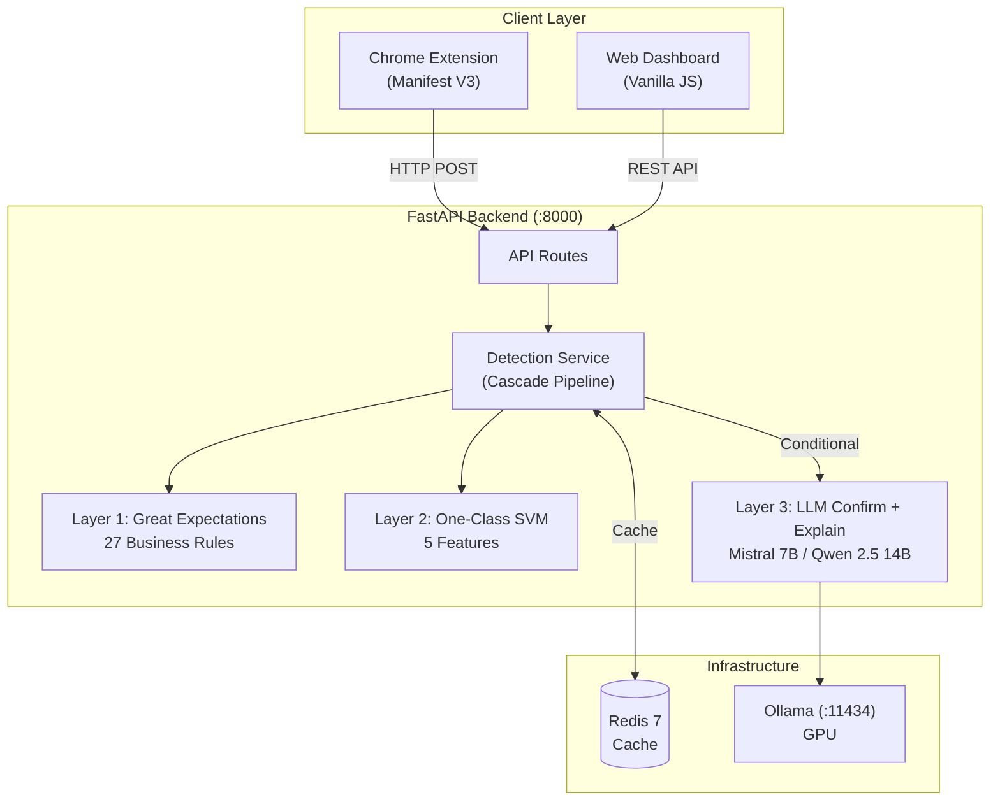
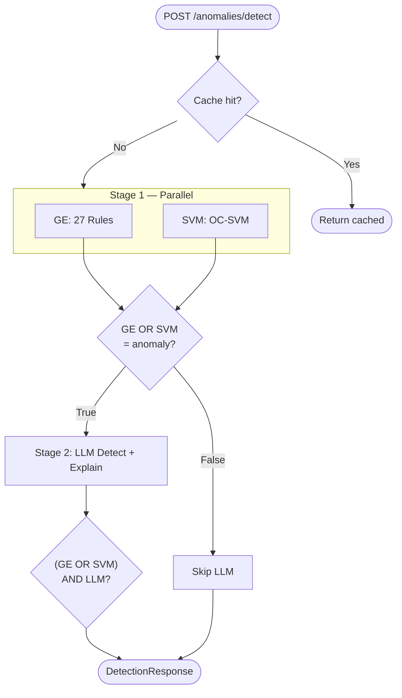

# Sadeed — Anomaly Detection System

> Multi-layer anomaly detection for Labour Force Survey data — rule engine, statistical model, and LLM working together.

---

## For Judges

### Live Deployment

| Resource | Link |
|----------|------|
| Live URL | *(deploy with `docker compose up`)* |
| Demo Video | [youtube.com/watch?v=l7OGKc13Byc](https://youtu.be/l7OGKc13Byc) |

### No API Keys Required

Sadeed runs entirely locally — no external API calls, no cloud dependencies, no keys to configure. The LLM runs on-device via Ollama. This means:

- **Data never leaves your network** — critical for sensitive labour force survey records
- **No rate limits or expiring tokens** — judges can test as many records as needed
- **Fully offline capable** — once Docker images are pulled and the model is downloaded, no internet connection is required
- **Reproducible results** — same model weights, same behaviour every time

### Quick Start (Docker)

Two deployment profiles — pick the one that fits your GPU:

| Profile | Command | Model | VRAM | F1 | Speed |
|---------|---------|-------|------|-----|-------|
| **Power-saving** | `docker compose up --build` | Mistral 7B | ~4.4 GB | 0.864 | ~0.7s/record |
| **Performance** | `docker compose -f docker-compose.performance.yml up --build` | Qwen 2.5 14B | ~9 GB | 0.927 | ~1.5s/record |

```bash
# Power-saving — works on most GPUs (4+ GB VRAM)
docker compose up --build

# Performance — requires 10+ GB VRAM
docker compose -f docker-compose.performance.yml up --build
```

Both start everything (Redis, Ollama + GPU, FastAPI backend). Wait for the `Application startup complete` log, then the system is ready on `http://localhost:8000`.

### Test 1 — Upload Excel File

1. Install the Chrome extension: `chrome://extensions/` → Developer mode → Load unpacked → select the `extension/` folder
2. Click the Sadeed extension icon in the toolbar
3. Switch to the **"Upload Excel"** tab
4. Click to select an `.xlsx` file (same format as the training dataset)
5. Each row is evaluated with a progress bar — results table shows verdict, confidence scores, and explanation

### Test 2 — Live Form Detection

1. Open any page with a form (or the survey platform)
2. Fill in some fields
3. Click the blue **"Scan Form"** button (bottom-right corner of the page)
4. Results overlay appears instantly — fields highlighted green (clean) or red (anomalous)
5. Click the extension icon for a per-strategy breakdown (GE, SVM, LLM)

### API Health Check

```bash
curl http://localhost:8000/anomalies/health
```

Expected: `{"great_expectations": true, "svm": true, "llm": true, "redis": true}`

---

## Architecture

> Diagram source: [`graphs/system-architecture.mmd`](graphs/system-architecture.mmd)



**Cascading pipeline**: GE and SVM run concurrently as Stage 1 via `asyncio.gather`. If **either** flags an anomaly, the LLM is invoked as Stage 2 to **confirm and explain** in a single call. The LLM operates in **confirmation mode** — it receives the SVM score as context and validates the flag rather than classifying from scratch. GE flags are treated as **ground truth** (deterministic business rules) and cannot be overridden by the LLM. SVM-only flags can be overridden, making the LLM a false-positive filter for statistical detections. Final verdict: `(GE OR SVM) AND LLM`. This avoids expensive LLM calls for clearly normal records while reducing false positives.

> Detailed flow: [`graphs/detection-pipeline.mmd`](graphs/detection-pipeline.mmd)

---

## Project Structure

```
Sadeed/
├── backend/
│   ├── main.py                  # FastAPI app + lifespan
│   ├── core/
│   │   ├── config.py            # pydantic-settings configuration
│   │   └── redis_client.py      # Async Redis client factory
│   ├── models/schemas.py        # DataPayload, StrategyResult, DetectionResponse
│   ├── detection/
│   │   ├── base.py              # BaseDetector ABC
│   │   ├── great_expectations_strategy.py   # Layer 1: GE rule engine
│   │   ├── svm_strategy.py                  # Layer 2: One-Class SVM
│   │   ├── llm_strategy.py                  # Layer 3: LLM few-shot explainer
│   │   ├── ensemble_llm_strategy.py         # Two-model LLM ensemble (experimental)
│   │   └��─ lfs_preprocessing.py             # LFS-specific derived columns
│   ├── services/detection_service.py        # Cascade pipeline orchestration
│   └── api/routes/
│       ├── anomalies.py         # /anomalies/* endpoints
│       └── health.py            # /health endpoints
├── data/
│   ├── LFS_Training_Dataset.xlsx
│   ├── LFS_Business_Rules.xlsx
│   ├── MetaData_LFS_Training_Dataset.xlsx
│   └── normal_samples.npy       # 67 real + 2000 simulated normal samples (4 features)
├── expectations/
│   └── suite.json               # Generated — GE expectation suite (27 rules)
├── models/
│   └── svm.joblib               # Cached trained OC-SVM pipeline
├── scripts/
│   ├── prepare_data.py          # Regenerates suite.json + normal_samples.npy (+ synthetic)
│   └── evaluate.py              # Evaluate detector performance (confusion matrices)
├── extension/
│   ├── manifest.json            # Chrome Manifest V3
│   ├── background.js            # Service worker — API relay
│   ├── content.js               # Form scanner + overlay UI
│   ├── popup.html               # Popup — scan results + Excel upload
│   ├── popup.js
│   ├── upload.html              # Full-page Excel upload UI
│   ├── upload.js                # Upload processing + API calls
│   ├── lib/xlsx.full.min.js     # SheetJS (bundled for CSP compliance)
│   ├── styles.css               # Injected page styles
│   └── icons/
├── frontend/
│   ├── index.html               # Dashboard
│   ├── demo-form.html           # Demo form with anomaly detection
│   ├── survey-form.html         # Full survey form with real API calls
│   ├── js/
│   │   ├── api.js               # HTTP client wrapper
│   │   ├── dashboard.js         # Polling + rendering loop
│   │   └── charts.js            # Chart.js integration
│   └── css/styles.css
├── graphs/                      # Mermaid diagram sources
│   ├── system-architecture.mmd
│   ├── detection-pipeline.mmd
│   ├── chrome-extension.mmd
│   ├── data-models.mmd
│   ├── deployment.mmd
│   └── api-routes.mmd
├── tests/
│   ├── test_great_expectations.py
│   ├── test_svm.py
│   ├── test_llm.py
│   ├── test_detection_service.py
│   ├── test_edge_cases.py       # 53 edge-case tests across all layers
│   ├── test_metrics.py          # Comprehensive metrics evaluation (all layer combos)
│   ├── test_metrics_large.py    # Large-scale: 400 synthetic records
│   ├── test_metrics_300.py      # 300-sample threshold comparison
│   └── test_metrics_ensemble.py # Two-model ensemble comparison
├── tutorial/                    # Local hosting & Cloudflare Tunnel guide
│   ├── README.md
│   ├── 01-prerequisites.md
│   ├── 02-start-sadeed.md
│   ├── 03-cloudflare-tunnel.md
│   ├── 04-expose.md
│   ├── 05-keep-running.md
│   ├── 06-troubleshooting.md
│   └── 07-windows-client.md
├── Dockerfile
├── docker-compose.yml               # Power-saving profile (Mistral 7B)
├── docker-compose.performance.yml   # Performance profile (Qwen 2.5 14B)
├── requirements.txt
└── .env                         # Local env overrides
```

---

## Detection Pipeline

> Diagram source: [`graphs/detection-pipeline.mmd`](graphs/detection-pipeline.mmd)



### Detection Layers

| Layer | Strategy | Method | Output |
|-------|----------|--------|--------|
| 1 | Great Expectations | 27 business rules from LFS_Business_Rules.xlsx: age-education minimums, salary-education cross-validation (rule 3047), sector-hours constraints (rules 3031-3036), age-salary checks, family relation constraints, marital status logic | `is_anomaly`, `score` (fraction failed), failed rule list |
| 2 | One-Class SVM | RBF kernel, `nu=0.1`, `gamma=0.001`, trained on 67 real samples + 2000 simulated samples, 5 features (`age`, `cut_5_total`, `act_1_total`, `q_602_val`, `edu_ordinal`) | `is_anomaly`, `score` (sigmoid of decision function) |
| 3 | LLM (Mistral 7B) | Confirmation prompting via Ollama with GE/SVM context | `is_anomaly` (confirms/overrides SVM; cannot override GE), `score`, human-readable explanation |

### Data Sourcing

The system uses two data sources for training:

- **Real samples (67)**: Extracted from `data/LFS_Training_Dataset.xlsx`, which contains 82 Labour Force Survey records (416 columns each). After filtering to rows with complete values for the 4 SVM features (`age`, `cut_5_total`, `act_1_total`, `q_602_val`), 67 normal records are used as the baseline.

- **Simulated samples (2000)**: Generated programmatically by `scripts/prepare_data.py`. The script calculates the mean and standard deviation of each feature from the 67 real samples, then produces 2000 synthetic records by sampling from matching normal distributions (log-normal for salary). This gives the One-Class SVM a much larger and denser representation of "normal" behaviour, resulting in a tighter decision boundary and fewer false positives.

Both are combined into `data/normal_samples.npy` (2067 x 4 matrix), which the SVM loads at startup for training. To regenerate:

```bash
python scripts/prepare_data.py
```

### Key Design Decisions

- **False-positive filter**: GE and SVM detect; the LLM confirms or overrides via `(GE OR SVM) AND LLM`
- **GE ground truth**: GE flags are deterministic business rules and cannot be overridden by the LLM. The LLM only filters SVM-only flags (false positive reduction)
- **Complementary detectors**: GE catches rule violations (salary floors, hours mismatch), SVM catches statistical outliers (elderly extreme hours, salary/hours combos). Only 41% overlap — both are essential
- **Single LLM call**: Detection and explanation happen in one call — the LLM's confirmation response includes the reasoning
- **Fail-safe**: Any strategy error returns `is_anomaly=False` so the pipeline never crashes
- **Conditional LLM**: Only invoked when GE or SVM flags an anomaly, saving GPU compute
- **Caching**: Results cached in Redis by `record_id` with configurable TTL (default 300s)

---

## Getting Started

### Option A: Docker (Recommended)

> Deployment diagram: [`graphs/deployment.mmd`](graphs/deployment.mmd)

**Prerequisites**: Docker, Docker Compose, NVIDIA Container Toolkit (for GPU)

```bash
# 1. Clone & enter project
cd Sadeed

# 2. Create .env file (optional overrides)
cat > .env << 'EOF'
REDIS_HOST=redis
REDIS_PORT=6379
OLLAMA_BASE_URL=http://ollama:11434
OLLAMA_MODEL=mistral:latest
EOF

# 3. Build & start all services
docker compose up --build
```

This command will:
- Start Redis 7 for caching
- Start Ollama with GPU passthrough and auto-pull `mistral:latest`
- Build the backend image (runs `prepare_data.py` to generate training data)
- Start FastAPI on port 8000
- Warm up the LLM (pre-load model into GPU memory)

**Without GPU** — If no NVIDIA GPU is available, remove the `deploy.resources` section from `docker-compose.yml`. Ollama will run on CPU (slower).

---

### Option B: Manual Setup

**Prerequisites**: Python 3.11+, Redis, Ollama, CUDA (optional)

```bash
# 1. Install Python dependencies
pip install -r requirements.txt
pip install openpyxl

# 2. Prepare training data (generates expectations/suite.json + data/normal_samples.npy)
python scripts/prepare_data.py

# 3. Start Redis
redis-server &

# 4. Start Ollama & pull model
ollama serve &
ollama pull mistral:latest          # power-saving (~4.4 GB VRAM)
# ollama pull qwen2.5:14b           # performance (~9 GB VRAM)

# 5. Create .env (change OLLAMA_MODEL to match the model you pulled)
cat > .env << 'EOF'
REDIS_HOST=localhost
REDIS_PORT=6379
OLLAMA_BASE_URL=http://localhost:11434
OLLAMA_MODEL=mistral:latest
EOF

# 6. Start the backend
uvicorn backend.main:app --host 0.0.0.0 --port 8000 --reload
```

---

## Chrome Extension Installation

> Extension flow diagram: [`graphs/chrome-extension.mmd`](graphs/chrome-extension.mmd)

1. Open Chrome and navigate to `chrome://extensions/`
2. Enable **Developer mode** toggle (top-right corner)
3. Click **Load unpacked** button (top-left)
4. Select the `extension/` folder from this project
5. A blue "Sadeed" icon will appear in the extensions toolbar. Click the pin icon to keep it visible

**Note**: The backend must be running on `localhost:8000` before using the extension. The green dot in the popup header confirms connectivity.

---

## How to Use

### Scan a Web Form

1. Open any page with a form
2. Fill in some fields
3. Click the blue **"Scan Form"** button (bottom-right corner)
4. Results overlay appears, fields highlighted: green = clean, red = anomalous
5. Click the extension icon for per-strategy breakdown

### Upload an Excel File

1. Click extension icon, switch to the **"Upload Excel"** tab
2. Click to select an `.xlsx` file
3. Each row is sent for detection with a progress bar
4. Results table appears with summary: total / anomalous / clean

---

## Testing

### Health Check

```bash
curl http://localhost:8000/anomalies/health
```

Expected response:

```json
{
  "great_expectations": true,
  "svm": true,
  "llm": true,
  "redis": true
}
```

### Manual Test — Normal Record

```bash
curl -s -X POST http://localhost:8000/anomalies/detect \
  -H "Content-Type: application/json" \
  -d '{
    "record_id": "test-normal",
    "data": {
      "age": 35,
      "gender": 1600001,
      "family_relation": 1700001,
      "marage_status": 10600002,
      "nationality": 1800001,
      "q_301": 10500025,
      "q_602_val": 15000,
      "cut_5_total": 40,
      "act_1_total": 40
    }
  }' | python3 -m json.tool
```

### Manual Test — Anomalous Record

```bash
curl -s -X POST http://localhost:8000/anomalies/detect \
  -H "Content-Type: application/json" \
  -d '{
    "record_id": "test-anomaly",
    "data": {
      "age": 12,
      "gender": 1600001,
      "family_relation": 1700001,
      "marage_status": 10600002,
      "nationality": 1800001,
      "q_301": 10500025,
      "q_602_val": 650000,
      "cut_5_total": 120,
      "act_1_total": 120
    }
  }' | python3 -m json.tool
```

This record violates multiple rules: age 12 as head of household (rule 2001), age 12 with bachelor's degree (rule 2013), salary 650,000 SAR (rule 3068), 120 weekly hours (rule 2088).

### Run Automated Tests

```bash
pytest tests/ -v
```

Tests across 9 files:

| Test File | Tests | Coverage |
|-----------|-------|----------|
| `test_great_expectations.py` | 7 | GE detector: loading, validation, error handling |
| `test_svm.py` | 12 | SVM detector: training, loading, caching, scoring |
| `test_llm.py` | 15 | LLM detector: few-shot prompting, parsing, fail-safe behavior |
| `test_detection_service.py` | 29 | Pipeline orchestration: caching, cascade logic, GE ground truth, borderline SVM, LLM override/confirm |
| `test_edge_cases.py` | 53 | Edge cases: `_safe_int`, derived columns, SVM/LLM/service boundaries |
| `test_metrics.py` | 1 | Metrics evaluation: 70 real records + 10 synthetic, all layer combinations |
| `test_metrics_large.py` | 1 | Large-scale: 400 synthetic records (200 normal + 200 anomalous) |
| `test_metrics_300.py` | 1 | 300-sample threshold comparison with multiple SVM thresholds |
| `test_metrics_ensemble.py` | 1 | Two-model ensemble comparison (Gemma + Mistral vs single) |

### Metrics Evaluation

Run the full metrics suite to see confusion matrices, score distributions, and synthetic anomaly results:

```bash
# Without LLM (GE, SVM, GE OR SVM)
pytest tests/test_metrics.py -v -s

# With LLM (adds LLM Alone and (GE OR SVM) AND LLM)
SADEED_LLM=1 pytest tests/test_metrics.py -v -s

# Large-scale: 400 synthetic records
SADEED_LLM=1 pytest tests/test_metrics_large.py -v -s

# 300-sample threshold comparison
SADEED_LLM=1 pytest tests/test_metrics_300.py -v -s

# Ensemble comparison (requires both gemma2:9b and mistral in Ollama)
SADEED_LLM=1 pytest tests/test_metrics_ensemble.py -v -s
```

Or run the standalone evaluation script:

```bash
python scripts/evaluate.py          # Without LLM
python scripts/evaluate.py --llm    # With LLM
```

---

## Performance

### Real LFS records (70 records)

Evaluated on 70 real LFS records (19 anomalous, 51 normal) with GE rules as ground truth:

| Configuration | Accuracy | Precision | Recall | F1 | FP |
|---------------|----------|-----------|--------|-----|-----|
| GE Alone | 1.000 | 1.000 | 1.000 | 1.000 | 0 |
| SVM Alone | 0.857 | 0.696 | 0.842 | 0.762 | 7 |
| GE OR SVM | 0.900 | 0.731 | 1.000 | 0.844 | 7 |
| LLM Alone | 0.514 | 0.347 | 0.895 | 0.500 | 32 |
| **(GE OR SVM) AND LLM** | **0.900** | **0.773** | **0.895** | **0.829** | **5** |

### Large-scale synthetic (400 records)

Evaluated on 400 generated records (200 normal + 200 anomalous, 10 anomaly types):

| Configuration | Accuracy | Precision | Recall | F1 | TP | FP | FN |
|---------------|----------|-----------|--------|-----|-----|-----|-----|
| GE Alone | 0.615 | 1.000 | 0.230 | 0.374 | 46 | 0 | 154 |
| SVM Alone | 0.823 | 0.971 | 0.665 | 0.789 | 133 | 4 | 67 |
| GE OR SVM | 0.927 | 0.978 | 0.875 | 0.923 | 175 | 4 | 25 |
| LLM Alone | 0.700 | 0.665 | 0.805 | 0.729 | 161 | 81 | 39 |
| **(GE OR SVM) AND LLM** | **0.833** | **0.972** | **0.685** | **0.804** | **137** | **4** | **63** |

### 300-sample threshold evaluation

Evaluated on 300 records (150 normal + 150 anomalous) with multiple pipeline configurations:

| Configuration | Accuracy | Precision | Recall | F1 | TP | FP | FN |
|---------------|----------|-----------|--------|-----|-----|-----|-----|
| GE Alone | 0.643 | 1.000 | 0.287 | 0.446 | 43 | 0 | 107 |
| SVM Alone | 0.783 | 0.967 | 0.587 | 0.730 | 88 | 3 | 62 |
| CURRENT: (GE\|SVM>0.5) AND LLM | 0.837 | 0.972 | 0.693 | 0.809 | 104 | 3 | 46 |
| Lower: (GE\|SVM>0.4) AND LLM | **0.860** | **0.929** | **0.780** | **0.848** | **117** | **9** | **33** |
| LLM Alone | 0.737 | 0.701 | 0.827 | 0.758 | 124 | 53 | 26 |

### Key insights

- **GE enforces deterministic business rules** from LFS_Business_Rules.xlsx — 100% precision, zero false positives across all tests
- **SVM is the primary anomaly catcher on synthetic data**: recall 0.665 (400-record) vs GE's 0.230 — the SVM detects statistical outliers that no business rule covers
- **GE and SVM are complementary**: combined recall jumps to 0.875 (400-record). GE catches rule violations (age-education, marital status); SVM catches extreme hours, unusual salary/hours combos
- **The LLM filters false positives**: precision stays above 0.97 in the full pipeline with only 3-4 FPs across hundreds of records
- **GE flags are ground truth** — the LLM cannot override them, only SVM-only flags
- **Full pipeline on real data: F1=0.829, 0 false negatives on GE-detectable anomalies** across 70 actual LFS records

### Model selection

Four models were evaluated in the full pipeline (GE OR SVM AND LLM) on 70 real LFS records:

| Model | Pipeline F1 | Precision | Recall | FP | VRAM | Speed |
|-------|-----------|-----------|--------|-----|------|-------|
| Qwen 3.5 9B | 0.316 | 1.000 | 0.188 | 0 | 6.6 GB | ~42s/rec |
| Gemma 2 9B | 0.820 | 0.940 | 0.727 | 3 | 5.5 GB | ~1.7s/rec |
| **Mistral 7B** (default) | **0.864** | **0.760** | **1.000** | **6** | **4.4 GB** | **~0.7s/rec** |
| **Qwen 2.5 14B** (high) | **0.927** | **0.864** | **1.000** | **3** | **~9 GB** | **~1.5s/rec** |

Sadeed ships with two deployment profiles:
- **Power-saving** (`docker-compose.yml`): Mistral 7B — best speed, perfect recall, works on 4+ GB VRAM
- **Performance** (`docker-compose.performance.yml`): Qwen 2.5 14B — halves false positives (6→3), still under 2s/record, needs 10+ GB VRAM

**Runtime**: 70 records in ~17s (Mistral 7B) or ~38s (Qwen 2.5 14B) on GPU.

---

## API Endpoints

> Diagram source: [`graphs/api-routes.mmd`](graphs/api-routes.mmd)

| Method | Endpoint | Description |
|--------|----------|-------------|
| `POST` | `/anomalies/detect` | Submit a data record for anomaly detection |
| `GET` | `/anomalies/detect/recent` | List most recent detection results (default 20) |
| `GET` | `/anomalies/detect/{record_id}` | Retrieve a cached result by record ID |
| `GET` | `/anomalies/health` | Health status of all detectors and Redis |
| `GET` | `/health` | Liveness probe |
| `GET` | `/health/ready` | Readiness probe |

### Request Body

```json
{
  "record_id": "uuid-string",
  "data": { "age": 35, "gender": 1600001, "q_602_val": 15000, "..." : "..." },
  "strategies": null
}
```

`strategies` — Optional. `null` runs all layers. Or specify a subset like `["svm", "llm"]`.

### Response Body

```json
{
  "record_id": "uuid-string",
  "is_anomaly": true,
  "llm_triggered": true,
  "llm_skip_reason": null,
  "explanation": "LLM-generated English explanation...",
  "results": [
    {
      "strategy": "great_expectations",
      "is_anomaly": true,
      "score": 0.238,
      "explanation": "5 of 21 expectation(s) failed: ...",
      "raw": { "failed_expectations": ["..."], "total_expectations": 21 }
    },
    {
      "strategy": "svm",
      "is_anomaly": true,
      "score": 0.8721,
      "explanation": "SVM classified record as anomalous ...",
      "raw": { "svm_prediction": -1, "decision_function_score": -1.94 }
    }
  ]
}
```

Note: The `explanation` field at the top level is the LLM-generated English explanation (only present when `llm_triggered` is `true` and the LLM confirms the anomaly). The LLM's own `StrategyResult` appears in the `results` array when triggered, showing its `is_anomaly` vote and confidence `score`.

---

## Data Models

> Class diagram: [`graphs/data-models.mmd`](graphs/data-models.mmd)

| Model | Purpose |
|-------|---------|
| `DataPayload` | Incoming request: `record_id`, `data` dict, optional `strategies` filter |
| `StrategyResult` | Per-strategy output: `strategy`, `is_anomaly`, `score`, `explanation`, `raw` |
| `DetectionResponse` | Aggregated response: all results + final `is_anomaly` verdict + LLM `explanation` |
| `StrategyName` | Enum: `great_expectations`, `svm`, `llm` |

---

## Configuration

All settings are loaded from `.env` via pydantic-settings:

| Variable | Default | Description |
|----------|---------|-------------|
| `REDIS_HOST` | `localhost` | Redis hostname |
| `REDIS_PORT` | `6379` | Redis port |
| `REDIS_DB` | `0` | Redis database index |
| `OLLAMA_BASE_URL` | `http://localhost:11434` | Ollama API base URL |
| `OLLAMA_MODEL` | `mistral:latest` | Model tag |
| `GE_EXPECTATION_SUITE_PATH` | `expectations/suite.json` | GE suite path |
| `OC_SVM_TRAINING_DATA_PATH` | `data/normal_samples.npy` | SVM training data |
| `OC_SVM_MODEL_PATH` | `models/svm.joblib` | Cached SVM model |
| `OC_SVM_KERNEL` | `rbf` | SVM kernel type |
| `OC_SVM_NU` | `0.1` | SVM nu parameter |
| `OC_SVM_GAMMA` | `0.001` | SVM gamma parameter |
| `ENABLE_GE_STRATEGY` | `true` | Enable Great Expectations |
| `ENABLE_SVM_STRATEGY` | `true` | Enable OC-SVM |
| `ENABLE_LLM_STRATEGY` | `true` | Enable LLM |
| `SVM_LLM_THRESHOLD` | `0.5` | SVM score threshold to trigger LLM |
| `DETECTION_CACHE_TTL_SECONDS` | `300` | Redis cache TTL in seconds |

If `GE_EXPECTATION_SUITE_PATH` or `OC_SVM_TRAINING_DATA_PATH` do not exist at startup, the corresponding strategy is disabled with a warning rather than crashing.

---

## Key Field Codes

| Field | Code | Meaning |
|-------|------|---------|
| `gender` | `1600001` | Male |
| `gender` | `1600002` | Female |
| `nationality` | `1800001` | Saudi |
| `family_relation` | `1700001` | Head of household |
| `family_relation` | `1700021` | Spouse |
| `family_relation` | `1700022` | Son |
| `family_relation` | `1700010` | Domestic worker |
| `marage_status` | `10600001` | Never married |
| `marage_status` | `10600002` | Married |
| `q_301` (education) | `10500031` | No formal education |
| `q_301` (education) | `10500019` | Secondary |
| `q_301` (education) | `10500023` | Diploma |
| `q_301` (education) | `10500025` | Bachelor's |
| `q_301` (education) | `10500009` | Master's |
| `q_301` (education) | `10500010` | PhD |
| `q_534` (sector) | `99400001` | Public sector |
| `q_534` (sector) | `99400003` | Private sector |
| `q_534` (sector) | `99400004` | Domestic worker |

---

## Diagrams

All architecture diagrams are maintained as Mermaid `.mmd` files in the [`graphs/`](graphs/) directory:

| File | Description |
|------|-------------|
| [`system-architecture.mmd`](graphs/system-architecture.mmd) | Full system overview — clients, backend, infrastructure |
| [`detection-pipeline.mmd`](graphs/detection-pipeline.mmd) | Detection cascade flow — cache, Stage 1, Stage 2, response |
| [`chrome-extension.mmd`](graphs/chrome-extension.mmd) | Extension data flow — content script, service worker, popup |
| [`data-models.mmd`](graphs/data-models.mmd) | Class diagram — Pydantic schemas and detector hierarchy |
| [`deployment.mmd`](graphs/deployment.mmd) | Docker Compose service topology and dependencies |
| [`api-routes.mmd`](graphs/api-routes.mmd) | API endpoint map with request/response types |

Render with any Mermaid-compatible tool (GitHub, VS Code Mermaid extension, [mermaid.live](https://mermaid.live), etc.).
